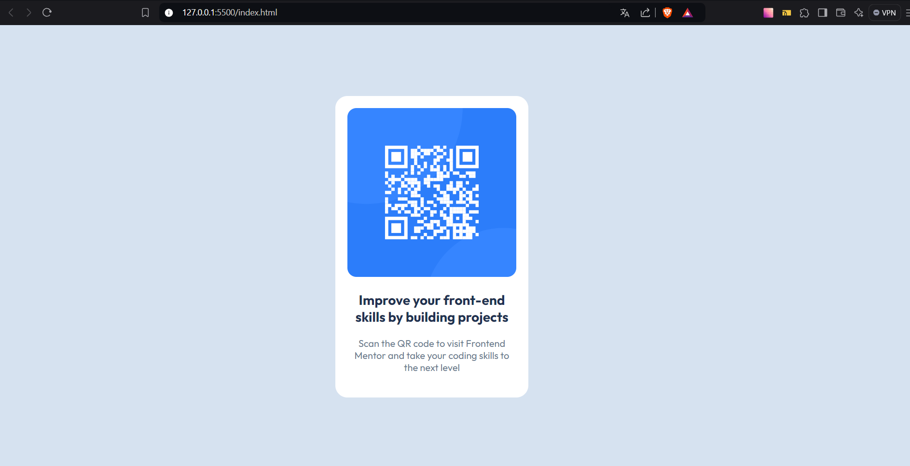

# Frontend Mentor - Solução de componente de código QR

Esta é uma solução para o [desafio do componente de código QR no Frontend Mentor](https://www.frontendmentor.io/challenges/qr-code-component-iux_sIO_H). Os desafios do Frontend Mentor ajudam você a melhorar suas habilidades de codificação através da construção de projetos realistas.

## Índice

- [Visão geral](#visão-geral)
  - [Captura de tela](#captura-de-tela)
  - [Links](#links)
- [Meu processo](#meu-processo)
  - [Construído com](#construído-com)
  - [Desenvolvimento contínuo](#desenvolvimento-contínuo)
  - [Recursos úteis](#recursos-úteis)
- [Autor](#autor)
- [Agradecimentos](#agradecimentos)

## Visão geral

### Captura de tela

### Links

- URL da solução: [Adicione a URL da solução aqui](https://github.com/cristian-souza/qr-code-component-main.git)
- URL do site ativo: [Adicione a URL do site ativo aqui](https://cristian-souza.github.io/qr-code-component-main/)

## Meu processo

### Construído com

- Marcação semântica HTML5
- Propriedades personalizadas CSS
- Flexbox

### Desenvolvimento contínuo

Ao construir este projeto tive a percepção de que preciso de mais pratica para assimliar o uso de cada propriedade CSS.

## Autor
- GitGub - [@cristian-souza](https://github.com/cristian-souza)
- Frontend Mentor - [@cristian-souza](https://www.frontendmentor.io/profile/cristian-souza)
- Linkedin - [@cristian-mm-souza](www.linkedin.com/in/cristian-mm-souza)

## Agradecimentos

Agradeço ao Mentores da Guilda Dev Quest que estão me ajuando no meu desenvolvimento na area da programa e aos Gemio Ricardo e Roberto dia por criarem um curso com grande enfanse em ajudar novos devs contreinamnetos e preparação para o mercado da programação web.
Deixo meu agradecimento ao criadores do Frontende Mentor por ajudarem de fomar dierta e inderetamento na construção das minhas habilidades com projetos excelente de pagina e sites webs.
